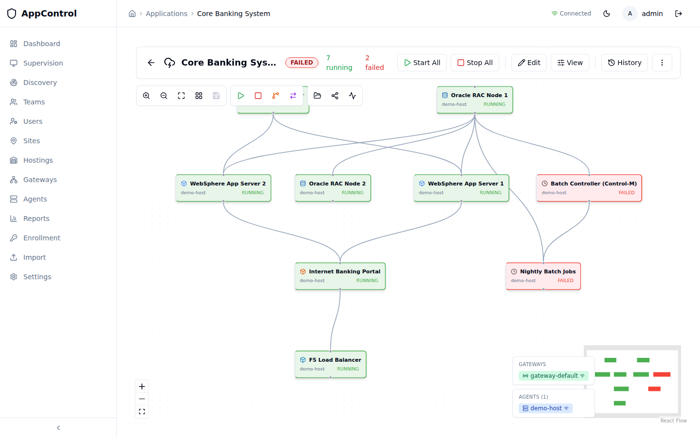
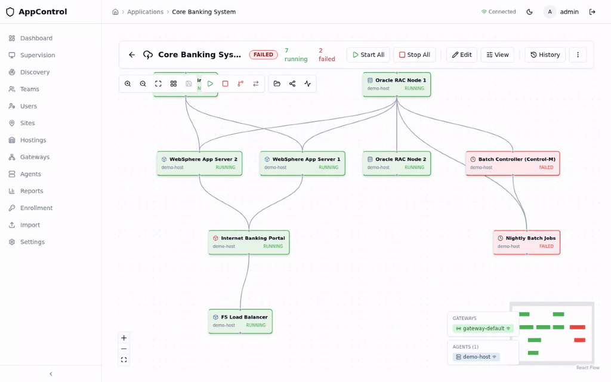

# AppControl

*Read this in [English](README.en.md) — shorter, technical-first summary.*

AppControl est une **plateforme d'exploitation pour applications critiques** — pour les équipes de production qui font tourner des systèmes où la disponibilité, la traçabilité régulatoire et la maîtrise du redémarrage ne sont pas négociables. Banques, assurances, télécoms, énergie, santé, opérateurs d'importance vitale, intégrateurs et MSP en charge de leurs applications.

Le projet est né d'un constat simple : depuis vingt ans, chaque famille d'outils ops s'est perfectionnée dans son métier — et aucune n'a été conçue pour lire l'application en mouvement. AppControl est **à cheval entre cinq familles d'outils existants** (supervision, CMDB, ordonnanceur, hyperviseur, orchestrateur de conteneurs) sans en remplacer aucune. C'est la couche qui leur manquait.



[](https://github.com/fredericcarre/appcontrol/actions/workflows/ci.yaml)
[](https://codecov.io/gh/fredericcarre/appcontrol)
[](https://github.com/fredericcarre/appcontrol/releases/latest)
[](#license)

---

## Les cinq questions auxquelles AppControl répond

Vos outils ops disent beaucoup de choses. Aucun n'a été conçu pour répondre aux questions que vous vous posez vraiment quand quelque chose se passe :

- L'**état réel** de vos processus, là, maintenant
- L'**impact** d'une panne sur le service rendu à l'utilisateur
- Le **temps** que prendra le redémarrage
- L'**ordre** dans lequel les composants doivent revenir
- Les **interactions** entre services pendant l'incident

AppControl répond à ces cinq questions. Il s'intègre avec les outils en place, ne demande aucun remplacement, et apporte la **vue d'ensemble exécutable** qui manquait.

> *La promenade en prod la plus simple que vous ayez jamais faite.*

---

## Trois moments, trois clics

### Dimanche 3h17 — le batch core banking a planté

Votre senior sysadmin est en vacances. La doc d'exploitation a deux ans de retard.

Vous ouvrez AppControl. La carte de l'application est déjà à l'écran. La branche en erreur est en rouge.
Un clic sur **Restart error branch**. Les composants redémarrent dans le bon ordre, en parallèle quand c'est possible.
Quatre minutes plus tard, tout est vert. L'audit est chaîné, signé, prêt à exporter.


### Mardi 14h — exercice de bascule DR Paris → Lyon

Six phases, rollback possible à chaque étape. Vous voyez chaque composant changer de site en temps réel. Le rapport de conformité est prêt avant la fin de la réunion.



### Vendredi 10h — l'ACPR demande la trace de la dernière bascule

Un clic sur **Export DORA**. Tout est là : signé, daté, immuable, append-only. Qui a fait quoi, quand, et pourquoi.


---

## Le quatrième moment : pilotez votre prod en langage naturel

AppControl expose un **serveur MCP natif**. Connectez Claude, ChatGPT, Cursor ou n'importe quel client compatible — et parlez à votre production.

```
Vous : "Quelles applications sont en état dégradé ce matin ?"
Claude : Trois applications : core-banking (branche batch en erreur),
         payment-gateway (latence anormale), reporting (composant absent).

Vous : "Redémarre la branche en erreur sur core-banking, en mode dry-run d'abord."
Claude : Plan d'exécution : 3 composants à redémarrer dans l'ordre
         [batch-loader → reconciler → reporter]. Durée estimée : 2 min 40.
         Je lance ?
```

<!-- SCREENSHOT:mcp-claude-control -->

C'est la première plateforme d'exploitation **AI-native** pour applications critiques. Aucun outil ITOM existant ne le permet aujourd'hui.

---

## Pourquoi maintenant

**DORA est en vigueur. NIS2 aussi.** Vos régulateurs vous demandent une chose simple :

> *« Prouvez-moi, à la seconde près, que vous savez ce qui tourne, dans quel ordre, et que vous pouvez le redémarrer sous contrôle. »*

Aucun de vos outils actuels ne sait faire ça seul. AppControl le fait à leur place, **sans rien remplacer**.

**Et la souveraineté redevient un sujet de comité.** Vos outils d'exploitation critiques sont presque tous américains : Datadog, Dynatrace, ServiceNow, BMC, PagerDuty. Toutes vos opérations passent par eux — leurs SLA, leurs juridictions, leurs lois extraterritoriales. AppControl se déploie **on-prem, en cloud privé, ou en air-gap complet**. Code Rust auditable, binaires signés, aucune dépendance à un cloud étranger. À notre connaissance, c'est aujourd'hui la seule plateforme d'exploitation applicative souveraine, sur ce niveau de profondeur fonctionnelle.

---

## DORA — pas du confort, une obligation

Règlement européen 2022/2554, applicable depuis le **17 janvier 2025**. Périmètre : entités financières et leurs prestataires ICT critiques.

**Ce que DORA *ne dit pas* :**

- « Vous devez utiliser tel outil »
- « Vous devez avoir telle architecture »
- « Votre RTO doit être de X heures »

**Ce que DORA *dit* :**

- *« Vous devez **prouver** que vous savez reconstruire. »*
- *« Vous devez **tester régulièrement**. »*
- *« Vous devez **documenter et tracer** chaque action. »*
- *« Vous devez **mesurer** votre temps de reprise réel. »*

| Exigence DORA | Article | Réponse AppControl |
|---|:---:|---|
| Cartographier fonctions métier, actifs ICT, interdépendances | 8 | Map JSON versionnée, captation depuis CMDB / XLR / XLD / référentiels de flux |
| Procédures de reconstruction après corruption ou cyberattaque | 12 | Moteur de rebuild : DAG order, protection des composants critiques, vérification post-rebuild |
| Tests des plans de continuité, au moins annuels | 11 | Dry-run + drill staging chronométrés, comparables d'une exécution à l'autre |
| Scénarios cyber et reprise après corruption | 25 | Drills répétés, RTR mesuré, régressions détectables |
| Registre des incidents et actions de récupération | 16 | Audit append-only (`action_log`, `state_transitions`, `switchover_log`, `check_events`) — aucun UPDATE, aucun DELETE, jamais |
| Mesure du RTO / RPO réel | 11–12 | RTR mesuré et tracé par exécution |

**Sanctions encourues :** jusqu'à **2 % du chiffre d'affaires annuel mondial** pour l'entreprise · jusqu'à **1 M€** pour les dirigeants, à titre personnel.

> Sans outil qui exécute la reconstruction, on ne peut ni la tester régulièrement, ni la chronométrer, ni la prouver. Le rebuild reste théorique — et donc non conforme.

---

## L'angle mort de votre stack

Chaque outil de votre chaîne ops a été conçu pour répondre à une question précise — et bien faire son métier signifie ne pas déborder. C'est ce qui les rend bons individuellement, et c'est aussi ce qui crée le trou de couverture qu'AppControl comble.

| Outil | Vous dit | Ne vous dit pas |
|---|---|---|
| **Supervision** (Datadog, Dynatrace, Prometheus, Zabbix) | Que la CPU est OK, que les métriques sont vertes | Si l'application *fonctionne* du point de vue métier |
| **CMDB** (ServiceNow, BMC) | Que l'application existe, et qui en est responsable | Son état actuel, en temps réel |
| **Ordonnanceur** (Control-M, AutoSys, $Universe, TWS) | Que le job a été lancé | Si le batch a livré, et avec quel impact |
| **Hyperviseur** (vSphere, Nutanix, Hyper-V) | Que la VM est démarrée | Ce qui tourne dedans, et si c'est utile |
| **Kubernetes / OpenShift** | Que les pods sont *Running* | Si l'application sert ses utilisateurs |

**AppControl s'intègre avec chacun de ces outils** — pour leur ajouter la lecture applicative qu'aucun n'était conçu pour fournir. Y compris au-dessus de Kube, et surtout pour les 70 % de votre SI qui ne tourneront jamais en conteneurs : mainframe, AS/400, batchs Cobol, monolithes Oracle, services Windows.

---

## Trois portes d'entrée

C'est le même produit, mais il s'aborde différemment selon votre besoin du moment.

### Vous reconstruisez une application critique
Vous avez un programme de modernisation à 12-24 mois. AppControl s'intègre comme **outil de pilotage de la reconstruction** : modélisation du DAG cible, validation progressive composant par composant, redémarrages propres tout au long du chantier, audit régulatoire livré clé en main en fin de programme. Périmètre : une application. Sortie possible à tout moment.

*Cible typique : banques, assurances, paiements, opérateurs critiques en programme de transformation.*

### Vous préparez votre conformité DORA / NIS2
Vous avez besoin de produire **une traçabilité régulatoire complète** sur vos opérations critiques : démarrages, arrêts, bascules, changements de configuration, accès. AppControl produit cet audit en sortie native — append-only, signé, chaîné — sans toucher à votre stack ops existante.

*Cible typique : RSSI et responsables conformité en finance, télécoms, énergie, santé, transport.*

### Vous voulez équiper vos astreintes 24/7
Vos opérateurs d'astreinte n'ont pas l'outil qu'il leur faut à 3 h du matin. AppControl est conçu pour cette fenêtre : carte applicative immédiate, redémarrage piloté avec ordre de DAG correct, audit automatique. Une seule console à ouvrir.

*Cible typique : intégrateurs, MSP, équipes SRE/ops d'organisations à criticité continue.*

---

## Garde-fous par conception

L'objection est légitime : un outil qui *peut* arrêter de la production peut aussi la casser. AppControl répond par construction, pas par procédure :

| Objection courante | Réponse intégrée |
|---|---|
| « Quelqu'un va arrêter de la prod par erreur » | RBAC granulaire à 5 niveaux par application (`view < operate < edit < manage < owner`). Aucun "admin global" implicite. |
| « On n'aura pas confiance dans la map au début » | **Mode advisory** : les agents observent sans rien exécuter. Vous voyez ce que la plateforme verrait — sans risque. |
| « On veut simuler avant d'exécuter » | **Dry-run** sur tout : `appctl start app --dry-run` retourne le plan complet (ordre DAG, commandes, agents cibles) sans rien lancer. |
| « Une action doit passer par revue » | **Mode PR-only** disponible : start / stop nécessitent une Pull Request mergée. La map et ses commandes sont versionnées comme du code. |
| « Trafic en clair entre composants » | **mTLS partout**. Pas de plaintext entre backend, gateway et agents. |
| « On ne saura pas qui a fait quoi » | **Audit append-only** : aucun UPDATE, aucun DELETE, jamais. Conforme Art. 16 DORA. |

Chaque application choisit son **niveau d'autonomie** — observation → diagnostic → opérations courantes → drill → DR — et peut redescendre à tout moment.

---

<!-- RELEASE-CUT -->
<!--
Everything above this marker is shared narrative — copied verbatim
into the corp release README (xcomponent/appcontrol-release).
Everything BELOW is dev-context-specific (git clone install, tech
dossier, dev license) and is replaced at release time by
corp/release-suffix.fr.md via .github/workflows/release.yaml.
Keep the marker on its own line; do not delete it.
-->

## Démarrer

Pas de formulaire. Pas de POC bricolé. Le bon premier pas, c'est un **engagement cadré** sur un périmètre nommé : une application critique, ou un projet de reconstruction en cours.

📩 **Décrivez votre cas en trois lignes** : un nom d'application, le scheduler en place, l'horizon DR à couvrir.
Réponse sous 48h.

📞 [Prendre 15 minutes en visio](#) pour une démonstration adaptée à votre stack.

---

## Sous le capot — *dossier technique*

Pile entièrement open architecture, déployable on-prem, en cloud privé, ou en mode air-gap.

| Couche | Technologie |
|---|---|
| Agents | Rust 1.88+ · Tokio · sysinfo · détachement de processus, buffer offline, mTLS |
| Gateway | Rust · Axum 0.7 · rustls · relais WebSocket |
| Backend | Rust · Axum · sqlx · PostgreSQL 16 ou SQLite · journal d'audit append-only |
| Frontend | React 18 · TypeScript 5.3 · Vite 5 · Tailwind · shadcn/ui · React Flow |
| MCP | Crate Rust dédié, exposé via stdio ou HTTP |
| Authentification | OIDC · SAML 2.0 · JWT RS256 · RBAC à 5 niveaux · partage par lien |
| Déploiement | Docker · Helm · OpenShift · mode air-gap |

### Démarrage en 5 minutes

```bash
git clone https://github.com/fredericcarre/appcontrol.git && cd appcontrol
docker compose -f docker/docker-compose.release.yaml up -d
open http://localhost:8080
```

Connexion : `admin@localhost`, mot de passe vide.

### CLI

```bash
appctl start core-banking --wait --timeout 120
appctl status core-banking --format table
appctl diagnose core-banking --level 2
appctl switchover core-banking --target-site lyon --mode FULL --wait
```

### Cartes d'application prêtes à l'emploi

Trois exemples dans [`examples/`](examples/) :

| Exemple | Composants | Points clés |
|---|:---:|---|
| [Three-Tier Web App](examples/three-tier-webapp.json) | 7 | Dépendances fortes/faibles, réplication BDD, batch |
| [Microservices E-Commerce](examples/microservices-ecommerce.json) | 12 | API gateway, message broker, service-per-DB |
| [Core Banking System](examples/banking-core-system.json) | 9 | Bascule DR Paris→Lyon, intégration Control-M, conformité DORA |

### Pour aller plus loin

- [QUICKSTART](docs/QUICKSTART.md) — installation complète, agents, premier pilote
- [Architecture](docs/architecture.md) — composants, flux, FSM, séquencement DAG
- [Sécurité](SECURITY_ARCHITECTURE.md) — mTLS, signature des audits, modèle de menace
- [Positionnement](docs/POSITIONING.md) — où AppControl s'insère dans votre écosystème
- [Conformité DORA](docs/PERMISSIONS.md) — RBAC, traçabilité, exports régulateur
- [Déploiement OpenShift](docs/OPENSHIFT.md) · [Azure Gateway](docs/AZURE_GATEWAY.md) · [Windows](docs/WINDOWS_DEPLOYMENT.md)

### Couverture de tests

| Module | Cible | Périmètre |
|---|:---:|---|
| `common/` | 90% | Transitions FSM, sérialisation protocole |
| `backend/core/` | 80% | FSM, DAG, permissions, switchover, diagnostics |
| `backend/api/` | 70% | Tous les endpoints : happy path + erreurs |
| `agent/` | 75% | Exécuteur, scheduler, buffer offline |
| `frontend/` | 60% | Hooks, stores, logique de permission |
| **E2E** | 9 scénarios | Pile complète avec base réelle et WebSocket |

```bash
cargo llvm-cov --workspace --html --output-dir coverage/
cd frontend && npm test -- --coverage
```

Voir [COVERAGE.md](COVERAGE.md).

### Développement

```bash
docker compose -f docker/docker-compose.dev.yaml up -d
cargo build --workspace
cargo test --workspace
cargo clippy --workspace -- -D warnings
cd frontend && npm run lint && npm run build
```

Voir [PROGRESS.md](PROGRESS.md) et le `CLAUDE.md` du crate concerné.

---

## License

Propriétaire. Tous droits réservés.
